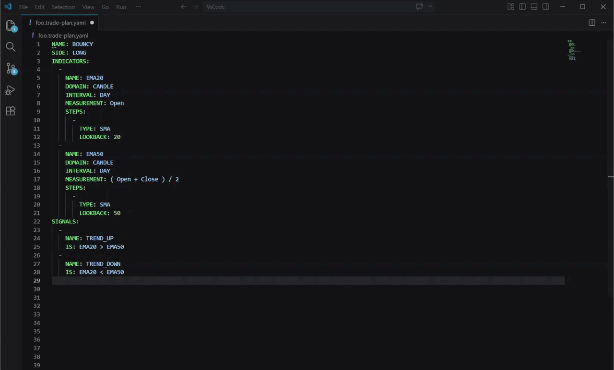

<p align="center">
  
</p>

<h1 align="center">WhaleRider</h1>

<p align="center"><strong>One language. Every signal.</strong></p>

<p align="center">
  Define cross-domain trading strategies in YAML, compile them into fixed
  <code>.wr</code> artifacts, and run the same artifacts in simulation or live trading.
</p>

<p align="center"><sub>WhaleRider by Rocksoldi</sub></p>

---

WhaleRider is a strategy compiler and deterministic trading runtime. Its YAML language can combine technical, fundamental, market breadth, insider, and economic data in one strategy definition.

```text
YAML source  ->  .wr artifact  ->  Simulation / Live
```

The compiler validates the declaration and creates a fixed execution plan. When the runtime receives the same inputs, the strategy produces the same decisions.

## Why compile strategies?

- Validate the complete strategy before execution.
- Keep trading logic in a versioned, portable artifact.
- Use the same artifact in simulation and live trading.
- Trace each decision from its YAML declaration to the resulting trade.
- Separate strategy logic, risk policy, and execution context.

## Workflow

| Step | Action | Result |
| --- | --- | --- |
| **01** | Define | Write strategy logic, risk, and execution settings in YAML. |
| **02** | Compile | Validate the YAML and produce a `.wr` artifact. |
| **03** | Run | Use the artifact in simulation or live execution. |
| **04** | Inspect | Query runs, trades, performance, and risk from the CLI. |

## Core files

| Component | YAML file | Purpose |
| --- | --- | --- |
| Trade plan | `*.trade-plan.yaml` | Indicators, signals, entry and exit criteria, universe, and position risk. |
| Risk policy | `*.risk-policy.yaml` | Account-level investment, margin, commission, and trade-risk limits. |
| Strategy | `*.strategy.yaml` | Composition of a trade plan and risk policy. |
| Simulation | `*.simulation.yaml` | Historical period, starting capital, and strategy execution context. |

## Quick start

### 1. Install the VS Code extension

The extension provides completion, schema validation, and diagnostics for WhaleRider YAML files.

1. Open **Extensions** in VS Code.
2. Search for **WhaleRider DSL**.
3. Select **WhaleRider DSL** and click **Install**.

### 2. Install the CLI

#### Windows PowerShell

```powershell
irm https://cli.whalerider.org | iex
```

#### Linux

```bash
curl -s https://cli.whalerider.org/install-wr.sh | tr -d '\r' | bash
```

Verify the installation:

```bash
wr --version
```

### 3. Compile locally

Compilation does not require an access profile.

```bash
wr compile --file ema-crossover.trade-plan.yaml
```

The command validates the YAML and creates a compiled `.wr` artifact.

## A complete strategy

This long-only EMA crossover is the smallest complete WhaleRider example. It enters when the 20-day EMA is above the 50-day EMA and exits when that relationship reverses.

```yaml
# EMA Crossover
#
# A small long-only trend strategy.
# Enter when the fast EMA moves above the slow EMA.
# Exit when the fast EMA moves below the slow EMA.

NAME: EMA_CROSSOVER
SIDE: LONG

RISK:
  ATR_INTERVAL: DAY
  ATR_LOOKBACK: 14
  STOP_LOSS_ATR: 2
  TAKE_PROFIT_ATR: 4
  HOLDING_MAX_PERIOD: 120D

UNIVERSE:
  MARKET_INDICES:
    - SP500
  MIN_MKT_CAP: 5000000000
  MIN_AVG_VOLUME: 1000000

INDICATORS:
  - NAME: EMA20
    DOMAIN: CANDLE
    INTERVAL: DAY
    MEASUREMENT: Close
    STEPS:
      - TYPE: EMA
        LOOKBACK: 20

  - NAME: EMA50
    DOMAIN: CANDLE
    INTERVAL: DAY
    MEASUREMENT: Close
    STEPS:
      - TYPE: EMA
        LOOKBACK: 50

SIGNALS:
  - NAME: TREND_UP
    IS: EMA20 > EMA50

  - NAME: TREND_DOWN
    IS: EMA20 < EMA50

CRITERIA:
  ENTER:
    IF: TREND_UP

  EXIT:
    IF: TREND_DOWN
```

[Open the complete EMA crossover file](Examples/ema-crossover/trade-plan.yaml)

## Strategy examples

The examples progress from a basic technical rule to multi-domain strategies and ordered state machines.

| Order | Example | Difficulty | Domains | What it demonstrates |
| --- | --- | --- | --- | --- |
| **01** | [EMA crossover](Examples/ema-crossover/trade-plan.yaml) | Simple | Technical | Daily indicators, signals, risk, and direct entry/exit criteria. |
| **02** | [Breadth recovery](Examples/breadth-recovery/trade-plan.yaml) | Intermediate | Technical + breadth | A sequential recovery state machine with an abort path. |
| **03** | [Quality value](Examples/quality-value/trade-plan.yaml) | Advanced | Fundamentals + technical | Valuation, profitability, debt, liquidity, and a long-term trend filter. |
| **04** | [Insider conviction](Examples/insider-growth/trade-plan.yaml) | Advanced | Insiders + economy + technical | Insider accumulation, macro conditions, and price trend in one strategy. |

> [!NOTE]
> These examples demonstrate the WhaleRider language. They are research starting points, not investment advice or a guarantee of returns.

## CLI reference

### Setup

```bash
wr --version
wr profile set --name <NAME> --access-key <ACCESS_KEY>
wr profile use --name <NAME>
wr profile list
```

Profiles are required for platform operations. Local compilation does not require a profile.

### Compile and deploy artifacts

```bash
wr compile --file <NAME>.trade-plan.yaml
wr compile --file <NAME>.risk-policy.yaml
wr compile --file <NAME>.strategy.yaml
wr deploy --file <NAME>.<COMPONENT>.wr
```

### Run and inspect simulations

```bash
wr simulation run --simulation-id <SIMULATION_ID>
wr simulation run get --simulation-run-id <RUN_ID>
wr simulation run list --table
wr simulation run performance get --simulation-run-id <RUN_ID> --group-interval ALL --table
```

### Inspect deployed definitions and trades

```bash
wr strategy list --table
wr trade-plan list --table
wr broker-account config list --table
wr trade list --broker-account-id <ACCOUNT_ID> --skip 0 --limit 20 --table
```

Use `wr help` to list commands, or `wr help <command>` for command-specific options.

## VS Code authoring

WhaleRider DSL helps author:

- nested entry and exit criteria;
- indicator measurements, intervals, lookbacks, and transforms;
- named signals and expressions;
- ATR-based risk settings; and
- market universes and ticker filters.



## Deterministic execution

`.yaml` defines intent.  
`.wr` defines execution.

Compilation creates a fixed strategy artifact with no hidden script state. That artifact is the unit deployed to each supported runtime.

For more detail, read [Strategies are compiled programs](https://medium.com/@erezlif/rocksoldi-whalerider-9570adb0d7cd).

## Contact

Questions or access requests: [whalerider@rocksoldi.com](mailto:whalerider@rocksoldi.com)

<sub>WhaleRider by Rocksoldi.</sub>
