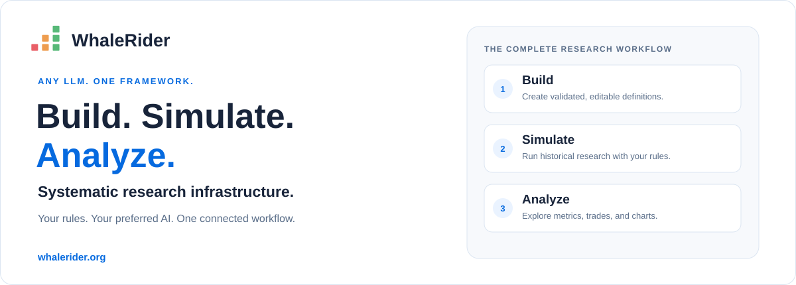
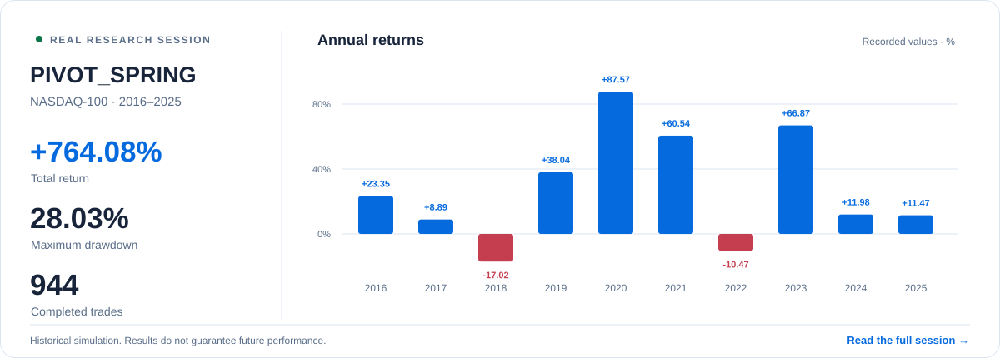

<p align="center">
  <a href="https://www.whalerider.org/">
    <picture>
      <source media="(max-width: 600px) and (prefers-color-scheme: dark)" srcset="assets/hero-mobile-dark.svg" />
      <source media="(max-width: 600px) and (prefers-color-scheme: light)" srcset="assets/hero-mobile-light.svg" />
      <source media="(prefers-color-scheme: dark)" srcset="assets/hero-dark.svg" />
      <source media="(prefers-color-scheme: light)" srcset="assets/hero-light.svg" />
      
    </picture>
  </a>
</p>

<p align="center">
  <strong><a href="https://www.whalerider.org/account/api">Connect WhaleRider →</a></strong>
  &nbsp; · &nbsp;
  <a href="https://www.whalerider.org/sessions">Real Sessions</a>
  &nbsp; · &nbsp;
  <a href="https://www.whalerider.org/docs">Documentation</a>
  &nbsp; · &nbsp;
  <a href="https://www.whalerider.org/pricing">Pricing</a>
</p>

# WhaleRider

**Build. Simulate. Analyze.**

WhaleRider brings systematic research infrastructure to the LLM and tools you already use.

Describe your own rules in natural language. WhaleRider turns them into validated, editable research artifacts, runs historical simulations using market and financial data, and helps you explore the results. Continue in your AI conversation, open the YAML in VS Code, or work through the CLI.

**Works with any MCP-compatible AI, online or desktop.**

This repository is the public companion to [whalerider.org](https://www.whalerider.org/): connection guides, research examples, and developer workflows. The hosted platform and its implementation are maintained separately.

## One conversation. The complete research workflow.

| Build | Simulate | Analyze |
| --- | --- | --- |
| Describe your universe, indicators, entry and exit rules, and risk assumptions. Create validated definitions that you can inspect and edit. | Choose the historical period and starting capital. Run your definitions in a simulated account and follow the run to completion. | Explore performance, drawdowns, simulated trades, annual returns, monthly heatmaps, and equity curves. Keep asking questions. |

For example, after connecting WhaleRider:

> Create a trade plan named WEAK_IBS_TRADE_PLAN. Use a maximum holding period of 60 days and a universe containing only SPY. Enter when IBS is below 0.1 and exit when IBS is above 0.8.

Then create the risk policy, strategy, and simulation, run it, and ask about the results. The [complete WEAK_IBS session](https://www.whalerider.org/sessions/weak-ibs) shows this workflow with its generated definitions and recorded analysis.

## See the research behind the product

<a href="https://www.whalerider.org/sessions/pivot-spring">
  <picture>
    <source media="(max-width: 600px) and (prefers-color-scheme: dark)" srcset="assets/pivot-spring-mobile-dark.svg" />
    <source media="(max-width: 600px) and (prefers-color-scheme: light)" srcset="assets/pivot-spring-mobile-light.svg" />
    <source media="(prefers-color-scheme: dark)" srcset="assets/pivot-spring-dark.svg" />
    <source media="(prefers-color-scheme: light)" srcset="assets/pivot-spring-light.svg" />
    
  </picture>
</a>

| Real session | Research question | Explore |
| --- | --- | --- |
| **PIVOT_SPRING** · NASDAQ-100 · 2016–2025 | Can financial strength and a staged recovery from monthly support form a systematic rule set? | [Full conversation](https://www.whalerider.org/sessions/pivot-spring) · [Local example](examples/pivot-spring/README.md) |
| **WEAK_IBS** · SPY · 2006–2025 | What happens when a single-ticker rule enters at low internal bar strength and exits at high internal bar strength? | [Full conversation](https://www.whalerider.org/sessions/weak-ibs) · [Local example](examples/weak-ibs/README.md) |

These are recorded historical simulations. Results depend on the definitions, data, period, and modeling assumptions; they do not guarantee future results. [Session details and source data](docs/real-sessions.md).

[Watch the 42-second introduction](https://www.whalerider.org/#intro-video-title) or [browse all real sessions](https://www.whalerider.org/sessions).

## Everything you need for systematic strategy research

| Capability | What you can do |
| --- | --- |
| **Your preferred AI** | Build, refine, simulate, and analyze through an MCP connection. |
| **VS Code IntelliSense** | Edit generated YAML with completion, hover documentation, and schema-aware diagnostics. |
| **CLI and automation** | Compile definitions, deploy artifacts, start simulations, and retrieve results from scripts. |
| **An expressive language** | Combine indicators, signals, sequential criteria, position controls, and reusable risk policies. |
| **Multi-domain data** | Research price, financial statements, ratios, macro, insider activity, short interest, and more. |
| **Historical simulation** | Inspect performance, simulated positions, and the periods behind the headline results. |

## Connect and start building

1. **Get workspace access.** Open [Connect WhaleRider](https://www.whalerider.org/account/api) and follow the access-key flow.
2. **Connect your AI.** Add the MCP server URL below to a compatible AI client. Enter your workspace admin access key on WhaleRider’s authorization page.
3. **Describe your research rules.** Ask WhaleRider to create and validate a trade plan. Continue with a risk policy, strategy, and historical simulation.
4. **Explore the completed run.** Ask for the summary, annual returns, drawdown periods, or individual simulated trades.

```text
https://mcp.whalerider.org
```

[Connection guide](docs/getting-started.md) · [Current access and pricing](https://www.whalerider.org/pricing)

## Go deeper

- [Examples](examples/README.md): complete research definitions and templates for your own workspace.
- [Artifact model](docs/artifact-model.md): how trade plans, risk policies, strategies, and simulations fit together.
- [CLI and VS Code](docs/developer-tools.md): local compilation, deployment order, simulation, and result inspection.
- [Product documentation](https://www.whalerider.org/docs): the complete language and command reference.

## Help and contact

For access, account, billing, or private support, contact [whalerider@rocksoldi.com](mailto:whalerider@rocksoldi.com). For a correction to these guides or examples, [open an issue](https://github.com/rocksoldi/whalerider/issues) or read [Contributing](CONTRIBUTING.md).

---

Software for user-directed research and historical simulation. WhaleRider does not execute trades, place orders, provide investment recommendations, manage assets, enable transactions, or provide brokerage services. Historical and simulated results do not guarantee future results.

WhaleRider © 2026 ROCKSOLDI LTD. [Terms](https://www.whalerider.org/terms) · [Privacy](https://www.whalerider.org/privacy) · [Refund policy](https://www.whalerider.org/refund-policy)
